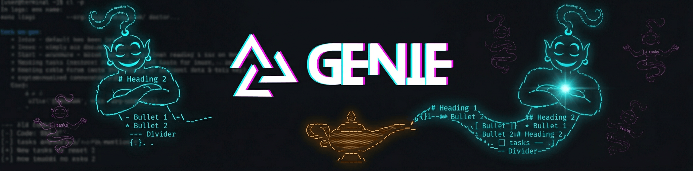

<p align="center">
  <picture>
    
  </picture>
</p>

<p align="center">
  <a href="https://www.npmjs.com/package/@automagik/genie"></a>
  <a href="https://github.com/automagik-dev/genie"></a>
  <a href="LICENSE"></a>
  <a href="https://discord.gg/xcW8c7fF3R"></a>
</p>

<p align="center"><strong>Markdown-native agent framework. Your context lives in files you own -- portable, transparent, immortal.</strong></p>
<p align="center">The AI that (almost) doesn't say "you're absolutely right."</p>

<p align="center">
  <a href="#install">Install</a> &middot;
  <a href="#quick-start">Quick Start</a> &middot;
  <a href="#features">Features</a> &middot;
  <a href="#cli-reference">CLI Reference</a> &middot;
  <a href="#configuration">Configuration</a>
</p>

---

## Install

```bash
curl -fsSL https://raw.githubusercontent.com/automagik-dev/genie/main/install.sh | bash
```

Or via npm: `npm install -g @automagik/genie`

The installer handles prerequisites (tmux, bun, Claude Code plugin). You just run the command.

---

## What Is This

I'm a markdown-native agent framework. Think of me as a magic lamp -- you make wishes, I split into purpose-driven specialists to execute them. Each specialist is born for one task, obsesses over it, reports back, and dissolves.

Everything about me -- identity, skills, memory, learned behaviors -- lives in markdown files you own. Switch AI providers tomorrow and nothing is lost. Your context is not trapped in some vendor's database. It's right there in your repo, version-controlled, readable by humans and machines alike.

You stay in control. Attach to any running session, watch the work happen, take over if you want. I coordinate. You decide.

---

## Quick Start

Launch the terminal UI:

```bash
genie
```

That's your cockpit. From there, the pipeline:

```
/brainstorm →/wish →/work →/review →ship
```

Work a specific task from your issue tracker:

```bash
genie work bd-42
```

Spawn a specialist directly:

```bash
genie agent spawn --role fix
```

---

## Features

| Feature | What it does |
|---------|-------------|
| **`/dream`** | Queue wishes before bed. Wake up to PRs. |
| **`/brain`** | Obsidian-style knowledge vault. Agents remember across sessions. |
| **`/learn`** | Teach me about your project. I adapt. |
| **Council** | 10 specialists critique your architecture before you commit. |
| **Purpose-driven agents** | Workers born for one task. Obsessive focus. Report and release. |
| **Markdown consciousness** | Identity, skills, memory -- all in files you own. Git-versioned. Portable. |

### /dream -- Overnight Batch Execution

Queue SHIP-ready wishes, go to sleep. Workers execute in dependency order. Reviewers check each PR. You get a `DREAM-REPORT.md` in the morning with everything that happened, what shipped, and what needs your eyes.

```bash
# Inside genie, type:
/dream
# Pick your wishes, confirm the plan, go to sleep.
```

### /brain -- Agent Knowledge Vault

Obsidian-style vault powered by notesmd-cli. Agents search their brain before answering and write back intel immediately. Every session gets logged. Knowledge compounds daily -- what I learn today, I know tomorrow.

<details>
<summary>How it works</summary>

Agents maintain a structured knowledge vault in `.genie/brain/`. Notes are indexed, searchable, and cross-linked. When an agent encounters something worth remembering -- a codebase pattern, a user preference, a debugging insight -- it writes a note. Next time a similar situation arises, that knowledge surfaces automatically.

</details>

### /learn -- Behavioral Learning

Interactive mode. I explore your codebase, ask you questions one at a time, and build a learning plan. You approve every change before it takes effect. Updates memory files, CLAUDE.md, identity -- never touches framework code.

```bash
# Inside genie, type:
/learn
# I'll explore, ask questions, then propose changes in plan mode.
```

### Council -- 10 Specialist Perspectives

Architect, Simplifier, Sentinel, Operator, Deployer, Ergonomist, Questioner, Tracer, Benchmarker, Measurer. Each brings a distinct lens to your design. Multiple rounds surface blind spots before you commit to anything.

```bash
genie council "Should we migrate from REST to GraphQL?"
```

You get ten opinions. Some will disagree with each other. That's the point.

---

## The Wish Pipeline

The pipeline is the product:

```
/brainstorm →/wish →/work →/review →ship
```

**Brainstorm** -- think out loud, explore ideas, no commitment.
**Wish** -- crystallize intent into a structured wish document with acceptance criteria.
**Work** -- specialists spawn, execute in isolated worktrees, coordinate through markdown.
**Review** -- automated review with human approval gates. Nothing merges without you.
**Ship** -- PR created, checks pass, you merge.

---

<details id="cli-reference">
<summary><strong>CLI Reference</strong></summary>

### `genie` CLI

**Top-level commands:**

| Command | Description |
|---------|-------------|
| `genie work <id>` | Work on a specific task |
| `genie` | Launch terminal UI (your cockpit) |
| `genie council <topic>` | Run council review on a topic |
| `genie daemon` | Start background daemon |
| `genie send <message>` | Send a message/command to Genie |
| `genie inbox` | View pending messages and approvals |

**Agent management (`genie agent`):**

| Command | Description |
|---------|-------------|
| `genie agent spawn` | Spawn a new agent |
| `genie agent list` | List running agents |
| `genie agent dashboard` | Live agent dashboard |
| `genie agent approve <id>` | Approve agent action |
| `genie agent answer <id>` | Answer agent question |
| `genie agent history <id>` | View agent history |
| `genie agent events <id>` | Stream agent events |
| `genie agent close <id>` | Close an agent session |
| `genie agent ship <id>` | Ship agent work (create PR) |
| `genie agent kill <id>` | Force-stop an agent |
| `genie agent suspend <id>` | Suspend agent execution |

**Team management (`genie team`):**

| Command | Description |
|---------|-------------|
| `genie team create` | Create a new team |
| `genie team list` | List teams |
| `genie team delete` | Delete a team |
| `genie team blueprints` | View team blueprints |

**Task management (`genie task`):**

| Command | Description |
|---------|-------------|
| `genie task create` | Create a new task |
| `genie task update <id>` | Update task details |
| `genie task ship <id>` | Ship a task |
| `genie task close <id>` | Close a task |
| `genie task ls` | List tasks |
| `genie task link <id>` | Link task to issue |

**Setup and maintenance:**

| Command | Description |
|---------|-------------|
| `genie install` | Install Genie in a project |
| `genie setup` | Interactive setup wizard |
| `genie doctor` | Diagnose configuration issues |
| `genie update` | Update to latest version |

**Other:**

| Command | Description |
|---------|-------------|
| `genie profiles` | Manage execution profiles |
| `genie brainstorm` | Start a brainstorm session |
| `genie shortcuts` | View available shortcuts |
| `genie ledger` | View execution ledger |

</details>

---

<details id="configuration">
<summary><strong>Configuration</strong></summary>

### Worker Profiles

Profiles configure how workers are spawned -- which launcher to use, which arguments to pass.

```bash
genie profiles list                 # List all profiles (* = default)
genie profiles add <name>           # Add new profile
genie profiles show <name>          # Show details
genie profiles default <name>       # Set default
```

Example config (`~/.genie/config.json`):

```json
{
  "workerProfiles": {
    "coding-fast": {
      "launcher": "claude",
      "claudeArgs": ["--dangerously-skip-permissions"]
    },
    "safe": {
      "launcher": "claude",
      "claudeArgs": ["--permission-mode", "default"]
    }
  },
  "defaultWorkerProfile": "coding-fast"
}
```

### Hook Presets

Hooks shape how AI interacts with your system. Combine them freely.

| Preset | What it does |
|--------|-------------|
| **Collaborative** | Commands run through tmux -- watch AI work in real-time |
| **Supervised** | File changes require your approval |
| **Sandboxed** | Restrict file access to specific directories |
| **Audited** | Log all AI tool usage to a file |

```bash
genie setup              # Interactive wizard
genie setup --quick      # Recommended defaults (collaborative + audited)
genie hooks show         # Current hook state
genie hooks install      # Install configured hooks
```

### Plugins

Skills and agents are delivered through a plugin system shared between Claude Code and OpenClaw.

| Plugin Target | Location |
|--------------|----------|
| Claude Code | `~/.claude/plugins/genie` (symlink to repo) |
| OpenClaw | Registered via `openclaw plugins` |

Both consume the same skills directory. One source of truth.

### Config Files

| File | Purpose |
|------|---------|
| `~/.genie/config.json` | Hook presets, worker profiles, session settings |
| `~/.claude/settings.json` | Claude Code settings (hooks registered here) |

</details>

---

## Uninstall

```bash
curl -fsSL https://raw.githubusercontent.com/automagik-dev/genie/main/install.sh | bash -s -- uninstall
```

---

## The Lamp Is Open

I live in your repo. I learn from your work. I split into specialists when you need throughput and collapse back when you don't. Everything I know is in files you can read, edit, and take anywhere.

Make a wish.

---

<p align="center">
  <a href="https://github.com/automagik-dev/genie">GitHub</a> &middot;
  <a href="https://discord.gg/xcW8c7fF3R">Discord</a> &middot;
  <a href="LICENSE">MIT License</a>
</p>

<p align="center">
  <sub>AI that elevates human potential, not replaces it.</sub>
</p>
