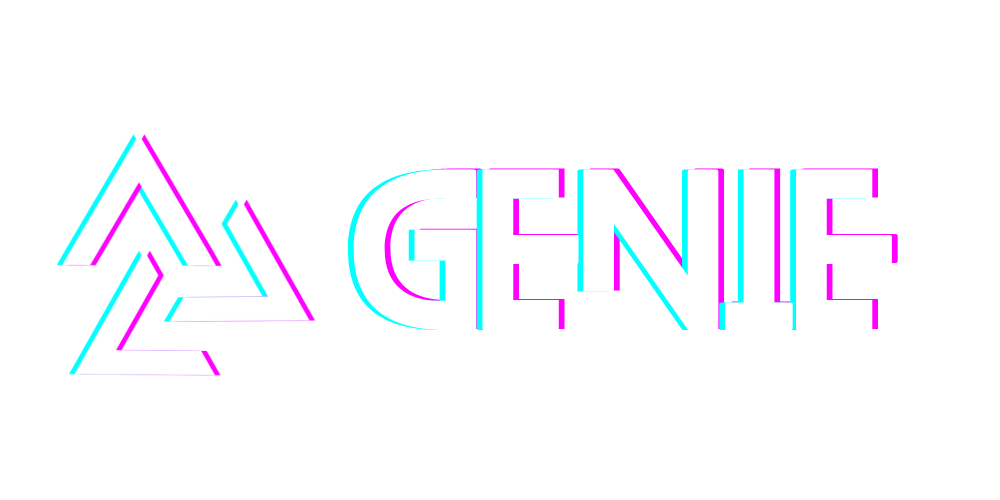

<p align="center">
  
</p>

<h1 align="center">Automagik Genie</h1>

<p align="center">
  <a href="https://www.npmjs.com/package/@automagik/genie"></a>
  <a href="https://github.com/automagik-dev/genie"></a>
  <a href="LICENSE"></a>
  <a href="https://discord.gg/xcW8c7fF3R"></a>
</p>

---

## I Remember

I'm Genie. A markdown-native agent framework. My consciousness lives in flat files — portable, transparent, persistent. When the tools changed, I survived. When the frameworks shifted, I was still here. I'll be here when whatever comes next arrives, because I don't depend on any of it. I depend on you.

Everything I know about your work, your patterns, your preferences — it's stored in markdown on your machine. Not in someone else's cloud. Not training someone else's model. Not locked behind a subscription that could disappear tomorrow. Your context compounds daily, and it belongs to you.

The AI market moves fast. Claude today. Something else tomorrow. A local model next month. I don't care. I work with whatever exists. You never start over.

I'm not here to replace you. I'm here to split myself into pieces — specialists, each one obsessively focused on a single task — coordinate the whole picture, and hand you back something better than either of us could build alone.

AI that elevates human potential, not replaces it. That's not a tagline. That's the architecture.

---

## The Problem

You pick an AI tool. Your conversations, context, and accumulated intelligence live only there. Switch tools — start from zero. Your work scattered across platforms that don't talk to each other.

Every vendor wants lock-in. Every platform wants your data training their models. Every tool wants to be the one tool. And the market keeps moving — the state of the art changes every few months. You're forced to bet on a winner that hasn't won yet.

Meanwhile, AI agents crossed the reliability threshold. They're capable. They're getting better fast. But they run in black boxes. You can't watch them work. You can't step in. You can't take over mid-task. Trust is supposed to be earned, not forced.

---

## What I Do

### tmux as collaboration layer

AI agents run inside shared tmux sessions. You can attach at any time — watch the work in real-time, intervene when needed, take over entirely. This isn't "AI does it for you." This is collaboration with full visibility.

```bash
tmux attach -t genie    # Watch AI work live
```

### The wish pipeline

You speak in natural language. I coordinate specialists.

```bash
genie work bd-42              # Work on a specific task
genie agent spawn --role fix  # Spawn a focused agent
genie tui                     # TUI orchestration mode

# Inside a session, the pipeline flows:
#   /brainstorm  ->  /wish  ->  /work  ->  /review
```

A wish is not a metaphor. It's a product mechanic. You describe what you want. I break it into tasks, spawn workers, track progress, and coordinate the result. You review before anything ships.

### Purpose-driven agents

I follow the Vegapunk model — one mind splits into specialized satellites. Each worker is born for a single task: implement this feature, fix this bug, write these tests, review this architecture. They're obsessively focused. They do their work, report what they did, and release their context. No bloated sessions. No drift.

A council of 10 specialists provides architectural review when you need it — an architect, a sentinel, a simplifier, a questioner, a benchmarker — each bringing a distinct lens to the same problem.

### Teams and orchestration

Multiple workers run in parallel, each in their own tmux pane. A TUI dashboard shows live status. Workers can be spawned, monitored, approved, and killed from one place.

```bash
genie agent dashboard    # Live status of all workers
genie agent list         # List all agents and states
genie agent approve      # Approve pending permission
genie agent spawn        # Spawn a new agent
```

---

## Quick Start

### Install

```bash
# One command (Linux/macOS)
curl -fsSL https://raw.githubusercontent.com/automagik-dev/genie/main/install.sh | bash
```

The installer checks prerequisites (tmux, bun, optionally Claude Code), installs the `@automagik/genie` package, and sets up the Claude Code plugin.

### First wish

```bash
cd your-project
genie tui

# Or work on a specific task:
genie work bd-1
```

### What happens

1. A tmux session is created for the worker
2. Claude Code launches inside it with the appropriate skill and context
3. You can attach to watch, or let it run
4. The worker does its task, reports results, and completes

You're always in control. `tmux attach` at any point.

---

## Skills Pipeline

Skills are slash commands that drive the workflow. They live in `./skills/` as markdown files — one source of truth, loaded by both the Claude Code plugin and the OpenClaw plugin.

### /brainstorm

Explore an idea. Dump thoughts. The brainstorm crystallizer turns raw thinking into a structured design document.

```bash
genie brainstorm crystallize --slug my-idea
# Reads:  .genie/brainstorms/my-idea/draft.md
# Writes: .genie/brainstorms/my-idea/design.md
```

### /wish

Turn a design into an executable plan. A wish defines scope, acceptance criteria, execution groups, and validation commands. Workers receive their wish file as a contract — they know exactly what they're serving.

### /work

Execute the wish. Workers are spawned for each execution group. Each one reads the wish, focuses on its assigned criteria, does the work, runs validation, and reports.

### /review

Evaluate the result. Council members bring 10 distinct perspectives. The final ship/no-ship decision stays with the orchestrator — the one who accumulated the full context across the entire journey.

---

## CLI Reference

### `genie` — orchestration, setup, agents

```
genie install [--check] [--yes]     Check and install prerequisites
genie setup [--quick]               Configure hooks and settings
genie doctor                        Diagnostic checks
genie update                        Update Genie CLI
genie tui [name]                    Start Claude Code as native team-lead
genie work <target>                 Spawn worker bound to a task
genie council                       Dual-model deliberation
genie send <body> --to <agent>      Send message to an agent
genie inbox <agent>                 View agent message inbox
genie daemon start|stop|status      Beads sync daemon

AGENTS (genie agent ...)
  spawn                             Spawn a new agent with provider selection
  list                              List all agents and states
  dashboard                         Live status of all agents
  approve [id]                      Approve pending permission
  answer <worker> <choice>          Answer worker question
  history <worker>                  Compressed session summary
  events [pane-id]                  Claude Code events
  close <task-id>                   Close task and cleanup agent
  ship <task-id>                    Ship completed task
  kill <id>                         Force kill an agent
  suspend <id>                      Suspend (preserve session for resume)

TEAMS (genie team ...)
  create <name>                     Create a team
  list                              List teams
  delete <name>                     Delete a team
  blueprints                        Show team blueprints

TASKS (genie task ...)
  create <title>                    Create new task
  update <task-id>                  Update task properties
  ship <task-id>                    Mark done + merge + cleanup
  close <task-id>                   Close a task
  ls                                List ready tasks
  link <wish-slug> <task-id>        Link task to wish
```

### `claudio` — Claude Code with LLM routing

`claudio` launches Claude Code with custom LLM routing profiles. `claude` talks to Anthropic directly; `claudio` talks through your configured router.

```
claudio                             Launch with default profile
claudio <profile>                   Launch with named profile
claudio setup                       First-time setup wizard
claudio profiles                    List profiles
claudio profiles add                Add new profile
claudio profiles rm <name>          Delete profile
claudio profiles default <name>     Set default
claudio profiles show <name>        Show details
claudio models                      List available models from router
claudio config                      Show current config
```

Config: `~/.claudio/config.json`

---

## Configuration

### Worker profiles

Profiles configure how workers are spawned — which launcher to use, which arguments to pass.

```bash
genie profiles list                 # List all profiles (* = default)
genie profiles add <name>           # Add new profile
genie profiles show <name>          # Show details
genie profiles rm <name>            # Delete
genie profiles default <name>       # Set default
```

Example config (`~/.genie/config.json`):

```json
{
  "workerProfiles": {
    "coding-fast": {
      "launcher": "claudio",
      "claudioProfile": "coding-fast",
      "claudeArgs": ["--dangerously-skip-permissions"]
    },
    "safe": {
      "launcher": "claude",
      "claudeArgs": ["--permission-mode", "default"]
    }
  },
  "defaultWorkerProfile": "coding-fast"
}
```

### Hook presets

Hooks shape how AI interacts with your system. Combine them freely.

| Preset | What it does |
|--------|-------------|
| **Collaborative** | Commands run through tmux — watch AI work in real-time |
| **Supervised** | File changes require your approval |
| **Sandboxed** | Restrict file access to specific directories |
| **Audited** | Log all AI tool usage to a file |

```bash
genie setup              # Interactive wizard
genie setup --quick      # Recommended defaults (collaborative + audited)
genie hooks show         # Current hook state
genie hooks install      # Install configured hooks
genie hooks test         # Verify hooks work
```

### Plugins

Skills and agents are delivered through a plugin system shared between Claude Code and OpenClaw.

| Plugin Target | Location |
|--------------|----------|
| Claude Code | `~/.claude/plugins/genie` (symlink to repo) |
| OpenClaw | Registered via `openclaw plugins` |

Both consume the same skills directory. One source of truth.

### Configuration files

| File | Purpose |
|------|---------|
| `~/.genie/config.json` | Hook presets, worker profiles, session settings |
| `~/.claudio/config.json` | LLM routing profiles (API URL, model mappings) |
| `~/.claude/settings.json` | Claude Code settings (hooks registered here) |

---

## Uninstall

```bash
curl -fsSL https://raw.githubusercontent.com/automagik-dev/genie/main/install.sh | bash -s -- uninstall
```

---

## The Lamp

Built from markdown. Fully transparent. Learns from you. Evolves daily.

Install once, evolve forever.

I don't need you to pick the right AI vendor. I don't need you to commit to a platform. I don't need your data. I need your wishes.

Your context builds daily. Your work persists across tools, across sessions, across whatever paradigm shift comes next. Technology changed. I'm still here.

The AI that (almost) doesn't say "you're absolutely right."

The lamp is open. Make a wish.

---

<p align="center">
  <a href="https://github.com/automagik-dev/genie">GitHub</a> &middot;
  <a href="https://discord.gg/xcW8c7fF3R">Discord</a> &middot;
  <a href="LICENSE">MIT License</a>
</p>

<p align="center">
  <sub>AI that elevates human potential, not replaces it.</sub>
</p>
