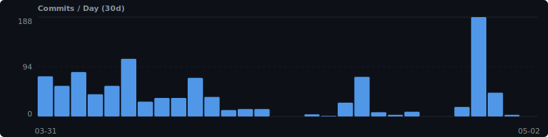

<p align="center">
  <picture>
    
  </picture>
</p>

<p align="center">
  <strong>Wishes in, PRs out.</strong>
</p>

<p align="center">
  <a href="https://www.npmjs.com/package/@automagik/genie"></a>
  <a href="https://www.npmjs.com/package/@automagik/genie"></a>
  <a href="https://github.com/automagik-dev/genie/stargazers"></a>
  <a href="LICENSE"></a>
  <a href="https://discord.gg/xcW8c7fF3R"></a>
</p>

<br />

<!-- TODO: Record a 30s terminal demo with vhs/asciinema and uncomment:
<p align="center">
  
</p>
-->

<!-- METRICS:START -->
**🚀 121 commits** this week · **7 releases** · **+28.1K LoC** · **6 contributors**



[📊 Full velocity dashboard →](VELOCITY.md)
<!-- METRICS:END -->

Genie is a CLI that turns one sentence into a finished pull request. You describe what you want — Genie interviews you, writes a plan, spawns parallel agents in isolated worktrees, reviews the code, and opens a PR. You approve. You merge. That's it.

## Get started

Paste this into Claude Code, Codex, or any AI coding agent:

```
Install Genie and set up this project:

curl -fsSL https://raw.githubusercontent.com/automagik-dev/genie/main/install.sh | bash
genie
/wizard
```

That's it. The wizard interviews you, scaffolds your project, and walks you through your first wish. Relax.

Or install manually:

```bash
curl -fsSL https://raw.githubusercontent.com/automagik-dev/genie/main/install.sh | bash
```

## What you get

```
  "Add dark mode"
       |
   /brainstorm ──── Genie asks questions until the idea is concrete
       |
   /wish ────────── Turns it into a plan: scope, criteria, task groups
       |
   /work ────────── Agents spawn in parallel worktrees, each on its own branch
       |
   /review ──────── 10 critics review. Severity-tagged. Nothing ships dirty.
       |
   Pull Request ─── You approve. You merge. Ship it.
```

**Parallel agents.** Not one agent doing everything sequentially — multiple agents working at the same time in isolated worktrees. No conflicts. No re-explaining context.

**Automated review.** A 10-critic council (architecture, security, DX, performance, ops, and more) reviews every design before you see it. Severity-tagged findings. CRITICAL blocks the PR.

**Overnight mode.** `/dream` — queue wishes before bed. Wake up to reviewed PRs.

**Kanban boards.** Built-in task boards with custom pipelines and stage gates.

**Postgres-backed.** All state lives in PostgreSQL — agents, tasks, events, messages. Queryable. Durable. Real-time via LISTEN/NOTIFY.

**Full observability.** Events, metrics, session replay, cost tracking. See everything your genie-spawned agents do — OTel-derived tool, cost, and API-request rows only cover sessions launched via `genie spawn` / `genie team create`; user-initiated Claude Code sessions are captured only when they export the OTLP env themselves.

**Portable context.** Identity, skills, memory — all markdown files in your repo, git-versioned. You own everything.

**Any AI provider.** Claude, Codex, or any OpenAI-compatible model. Bring your own agent.

## Why Genie?

<table>
<tr>
<td width="50%">

### Without Genie

- Re-explain context every new chat
- One agent, one file at a time
- Copy-paste PR descriptions manually
- Review AI code yourself, line by line
- Context lost mid-conversation
- No memory between sessions

</td>
<td width="50%">

### With Genie

- Context captured once, inherited by every agent
- Parallel agents in isolated worktrees
- Automated severity-gated code review
- Queue wishes overnight, wake up to PRs
- 10-critic council catches what you'd miss
- Persistent memory across sessions

</td>
</tr>
</table>

## Skills

17 built-in skills that compose into workflows:

| Skill | What it does |
|-------|-------------|
| `/brainstorm` | Explore vague ideas with guided questions |
| `/wish` | Turn an idea into a scoped plan with acceptance criteria |
| `/work` | Execute a wish with parallel agents |
| `/review` | Severity-gated code review (SHIP or FIX-FIRST) |
| `/council` | 10-perspective architectural deliberation |
| `/dream` | Batch-execute wishes overnight |
| `/trace` | Investigate bugs — reproduce, isolate, root cause |
| `/fix` | Minimal targeted bug fixes |
| `/report` | Deep investigation with browser + trace |
| `/refine` | Transform rough prompts into structured specs |
| `/learn` | Correct agent behavior from mistakes |
| `/docs` | Audit and generate documentation |
| `/pm` | Full project management playbook |
| `/brain` | Knowledge graph with Obsidian-compatible vaults |
| `/genie` | Auto-router — natural language to the right skill |
| `/genie-hacks` | Community patterns and real-world workflows |
| `/wizard` | Guided first-run onboarding |

## What's new in v4

v4 is a ground-up rewrite. 700 commits. 300 files. ~19K lines.

| | v3 | v4 |
|---|---|---|
| **State** | JSON files + NATS | PostgreSQL + LISTEN/NOTIFY |
| **UI** | CLI only | Full terminal UI |
| **Memory** | None | Optional knowledge brain |
| **Tasks** | Basic | Kanban boards, templates, projects |
| **Observability** | Minimal | OTLP, session capture, audit trail |
| **Review** | Single pass | 10-critic council deliberation |
| **Stability** | Best effort | Advisory locks, spawn watchdog, 200+ bug fixes |

[Full v4 release notes →](https://github.com/automagik-dev/genie/releases/tag/v4.260402.18)

### Observability substrate (v0)

Structured event emission, signed subscription tokens, 4-tier retention, and
an external dead-man's switch. Consumer-compat promises are published at
[docs/observability-contract.md](docs/observability-contract.md); the 5-phase
rollout plan at [docs/observability-rollout.md](docs/observability-rollout.md).

### Executor read endpoint

External consumers (e.g. the omni scope-enforcer) can query ground-truth turn
state directly from `genie serve`. Two paths are supported:

**HTTP** — `GET http://127.0.0.1:<port>/executors/:id/state` returns
`{state, outcome, closed_at}` as JSON. The default port is `pgserve_port + 2`;
override with `GENIE_EXECUTOR_READ_PORT`. Returns 404 for unknown IDs, 400 for
non-UUID IDs, 200 otherwise. No authz — executor IDs are random UUIDs and the
view exposes no secrets.

**Direct SQL** — connect to genie-PG as the read-only `executors_reader` role
and `SELECT state, outcome, closed_at FROM executors_public_state WHERE id = $1`.
Layer login credentials on top:

```sql
CREATE ROLE omni_scope_enforcer LOGIN PASSWORD '…' IN ROLE executors_reader;
```

Response shape (`state` / `outcome` / `closed_at`) is the stable boundary
contract; removing or renaming fields is a coordinated breaking change.

## Design

Genie ships a single, dark-only color palette inspired by **Severance** — the Lumon MDR room. One source of truth (`packages/genie-tokens/`), three consumers (TUI, desktop app, tmux). See [docs/design-system.md](docs/design-system.md) for tokens, the Severance rationale, how to add a color, how to regenerate the tmux theme, and the visual snapshot workflow.

---

<p align="center">
  <a href="https://docs.automagik.dev/genie"><strong>Docs</strong></a> &middot;
  <a href="docs/design-system.md"><strong>Design</strong></a> &middot;
  <a href="https://github.com/automagik-dev/genie/releases/tag/v4.260402.18"><strong>v4 Release</strong></a> &middot;
  <a href="https://discord.gg/xcW8c7fF3R"><strong>Discord</strong></a> &middot;
  <a href="LICENSE"><strong>MIT License</strong></a>
</p>

<p align="center">
  <sub>You describe the problem. Genie does everything else.</sub>
</p>
