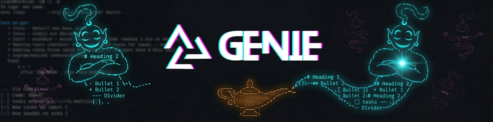

<p align="center">
  
</p>

<p align="center"><strong>Wishes in, PRs out.</strong></p>

<p align="center">
  <a href="https://github.com/automagik-dev/genie/releases"></a>
  <a href="https://github.com/automagik-dev/genie/stargazers"></a>
  <a href="LICENSE"></a>
  <a href="https://discord.gg/xcW8c7fF3R"></a>
</p>

<br />

Genie is a planning-and-execution layer for AI coding agents. You describe what you want in one sentence; Genie interviews you into a plan, dispatches agents to build it in parallel, reviews the result against acceptance criteria, and hands you something ready to merge.

The whole thing is a lightweight body: a set of skills, plain-markdown documents in git, and a single per-repo SQLite file. No daemons, no Postgres, nothing resident. A command opens the database, runs one transaction, and exits.

## Install

```bash
curl -fsSL https://raw.githubusercontent.com/automagik-dev/genie/main/install.sh | bash
```

Every release is cosign-signed (keyless OIDC) with SLSA provenance; the installer verifies the binary — via `gh attestation verify`, falling back to `cosign verify-blob` — before it runs.

The repository-hosted `.well-known/latest.json` and `dev.json` manifests are the authoritative channel pointers. GitHub's `/releases/latest` route and prerelease badge are deliberately not channel authority: a promotion advances only a monotonic manifest and never rewrites already-published assets or channel-significant draft/prerelease/latest metadata.

The installer detects Claude Code and Codex and delivers the selected, version-matched payloads. Control this with `--integrations auto|codex|claude|all|none` or `--skip-integrations`. Codex delivery is deliberately separate from activation: install/update verify the signed release and publish a complete authenticated delivery record, but never advance the Codex cache, change its enabled state, reconcile its project route, or write role agents. A delivered generation that still needs activation exits with an action-required result directing the operator to `genie setup --codex`.

From inside a trusted initialized repo, run `genie init` to scaffold state and retire proven-owned historical MCP routes. Then run `genie setup --codex` from an external interactive terminal. Setup requires a matching authenticated delivery record before its first prompt or mutation; it activates the delivered plugin, proves the exact enabled payload, retires only clean historical user-tier fallbacks, and converges seven optional role agents. An already-current deliberately disabled plugin stays disabled, skips fallback retirement, and still repairs managed roles. Personal, modified, malformed-marker, and symlinked collisions remain untouched. Successful setup persists Codex delivery scope for later explicit updates, but those updates still deliver only; a new generation requires a fresh setup assertion. No hook installs software, activates plugins, synchronizes skills, or writes project instructions.

Codex never auto-trusts plugin hooks. H4/H6 definitions bind the exact plugin launcher SHA-256 and the launcher verifies itself before spawning, so launcher changes produce new definitions; the current hook schema still cannot transitively bind the mutable platform-specific Genie binary. After successful Codex setup, inspect the three Genie definitions with `/hooks`, approve only the hashes you understand, and start a new task so the reviewed definitions take effect. Until then they remain untrusted and do not run.

## Standalone and Orca authority

Genie has two explicit lifecycle modes. `standalone` is the default, including when the configuration omits
`orchestration.mode`; merely installing or opening Orca never changes authority. Standalone keeps the existing local
task, board, and roadmap behavior. Select Orca only when you intend Orca to become the sole lifecycle authority:

```bash
genie setup --orchestration-mode orca
genie doctor
```

The switch first verifies the shipped plugin payload and a compatible Orca runtime (Orca `1.4.192` or newer with
`orchestration.contract.v1`). Only after that probe succeeds does Genie back up its configuration and atomically select
Orca. In Orca mode, Genie does not open `.genie/genie.db` for lifecycle reads or writes and refuses roadmap writes,
syncs, and exports before they can create or change local files. Existing local history is preserved in place, but it is
not imported, mirrored, or treated as current. The plugin keeps no fallback database: if Orca is unavailable, the
operation fails instead of silently returning to standalone.

Switching back is also deliberate and does not import Orca state:

```bash
genie setup --orchestration-mode standalone
genie doctor
```

`genie doctor` reports the selected authority, plugin ownership state, resolved runtime version, and compatibility.
`unsupported_environment` means the host cannot provide the supported public CLI/child-process boundary; install or
start a compatible Orca runtime and repeat the Orca selection. Do not work around it with a private API, internal RPC,
terminal injection, or a local fallback.

### Install, update, rollback, and uninstall

Signed release tarballs include `plugins/genie/orca-plugin.json` and the compiled Orca entrypoint on every supported
platform. The normal installer stages and verifies that payload; authority remains standalone until the explicit setup
command above. `genie update` preserves the selected mode and lifecycle history, verifies the replacement payload, and
refreshes a prior Genie ownership claim only after an Orca compatibility probe. Run `genie doctor` after installation or
update before resuming lifecycle mutations.

`genie update --rollback` checks the retained rollback state and prints signed-version reinstall guidance when a safe
in-place rollback is unavailable; follow that guidance, then run `genie doctor`. A failed update, rollback, or mode
preflight leaves the prior configuration and authority unchanged. `genie uninstall` removes only ownership-proven Genie
artifacts and registrations. Modified or unproven files are preserved, and neither local Genie history nor Orca records
are deleted. Review the command's backup/recovery output before removing any retained files manually.

### Ambiguous Orca receipts and recovery

The plugin invokes only a closed subset of official `orca orchestration ... --json` commands. Successful mutations
require a bounded receipt and, where the public CLI supports it, an immediate public read-back. If the process times out,
exceeds its output cap, or loses transport after launch without a complete identifying receipt, Genie reports
`ambiguous_after_possible_commit`. Do not automatically retry: Orca may already have committed the operation. Inspect
the exact public read operation named by the error only when the identifier was known before launch; otherwise confirm
the outcome with an Orca operator before deciding whether to issue a new mutation. Genie never guesses an identifier
from a collection or infers success from a partial response.

### MCP retirement

The legacy Genie MCP server is retired. `genie mcp` exits non-zero with a stable diagnostic and never starts a server;
use the standalone `genie task` and `genie board` commands instead. `genie init` removes only marker-owned or exact
Genie-owned historical project registrations and preserves unrelated or unproven user configuration byte-for-byte.
Rollback to a pre-A7 signed release remains the migration escape hatch.

Maintainers should read the [public Orca boundary and verb-amendment contract](plugins/genie/references/orca-orchestration.md)
before changing the adapter or its operator guidance.

## Quickstart

The lifecycle is shared by Claude Code and Codex. Claude uses slash skills. A Codex plugin install uses the unambiguous owner-qualified `$genie:<skill>` selector; bare `$<skill>` resolves the user tier, which now only ever holds a separately installed personal copy (Genie no longer seeds the user tier):

```text
1. /brainstorm or $genie:brainstorm   an idea → DESIGN.md → digest-bound mandatory design review
2. /wish or $genie:wish               accepted DESIGN.md → a scoped WISH.md
3. /review or $genie:review           mandatory plan review; persist APPROVED or concrete gaps
4. /work or $genie:work               native role agents build each approved group
5. /review or $genie:review           independent implementation review: SHIP, FIX-FIRST, or BLOCKED
```

These are manual invocation selectors. Codex starter cards embedded in each physical skill are selector-free, so the selected plugin-tier or user-tier card cannot redirect to its same-name copy in another tier.

Re-run `genie board` any time for a current snapshot of task state on the kanban. The plan documents land in git as you go; the operational state lives in `.genie/genie.db`.

## What's inside

- **Skills** carry the methodology — `brainstorm → design review → wish → plan review → work → implementation review`, authored once for native Claude and Codex surfaces.
- **Documents in git.** Wishes, designs, and brainstorms are plain markdown under `.genie/wishes/<slug>/` and `.genie/brainstorms/<slug>/`; you diff, review, and version them like any other code.
- **One file of state.** Tasks, boards, dependency edges, and wish-group execution state live in a single per-repo SQLite file (`.genie/genie.db`), on Bun's built-in engine.
- **Small.** 16 CLI commands, 4 runtime dependencies (`@inquirer/prompts`, `commander`, `zod`, `nats`) — `nats` initializes only when the omni runner starts. A ~0.9 MB single-file bundle. Bun-powered.
- **Spawn-context contract.** `genie context --wish <slug> [--group g] [--plan]` emits one line of versioned JSON — composed branch + resolved base SHA + ready tasks — that a spawn consumes. `--plan` previews the same payload without side effects; the wishless form resolves the repo's integration branch for plain spawns.
- **Zero daemons, no Postgres.** Nothing runs in the background between invocations.

## Commands

```bash
genie --help
```

| Command | What it does |
|---------|-------------|
| `genie init` | Scaffold per-repo state and retire proven Genie-owned project MCP registrations |
| `genie context` | Resolve spawn context — wish/group branch + base SHA, or the integration branch (versioned JSON; `--plan` previews) |
| `genie board` | Kanban view of task state, derived live by query |
| `genie idea` | Capture an idea into the roadmap board Idea lane (creates the board if absent) |
| `genie task` | Inspect and drive task state (SQLite, zero-daemon) |
| `genie ui-bridge` | Run the UI-owned stdio MCP bridge into genie.db (reads + roster writes + change-push) |
| `genie install` | Finish a verified install and deliver selected integrations; Codex activation is deferred to setup |
| `genie mcp` | Return the stable non-zero MCP-retirement diagnostic |
| `genie omni` | Bridge agents to WhatsApp via Omni — remote approvals + inbound one-shots (`serve`, `status`, `inbox`, `handshake`) |
| `genie setup` | Configure Genie; `setup --codex` activates an authenticated delivery and converges Codex-owned surfaces |
| `genie doctor` | Run diagnostic checks on the installation |
| `genie hook` | Provider-neutral hook middleware with Claude/Codex wire adapters |
| `genie shortcuts` | Manage terminal keyboard shortcuts |
| `genie update` | Update Genie to the latest GitHub release |
| `genie uninstall` | Remove Genie and clean up its hooks |
| `genie help` | Show help for any command |

## Skills

Skills are the product. Invoke them as `/name` in Claude, `$genie:name` from the Codex plugin, or `$name` only when intentionally selecting a corresponding personal user-tier copy you installed yourself:

| Skill | What it does |
|-------|-------------|
| `brainstorm` | Explore a vague idea until it's a concrete DESIGN.md |
| `wish` | Turn a design into a scoped WISH.md with execution groups |
| `work` | Dispatch native role subagents wave by wave |
| `review` | Severity-gated verdict — SHIP, FIX-FIRST, or BLOCKED |
| `council` | Independent architecture, delivery, product, security, and dissent assessment |

Shared skill bodies use a runtime-neutral delegation contract. Codex maps it to the optional `genie_*` custom-agent profiles installed by the CLI; a plugin-only install still has skills but no custom agents. Codex subagents share a workspace, so task claims own scope; worktree isolation, when required, is orchestrator-arranged per the dispatch contract. The engineer reports completion, an independent reviewer returns a verdict, and only the orchestrator runs `genie task done`. `/level-up` remains Claude-only because it evaluates Claude Code mastery.

### Codex surface boundaries

These five inventories are intentionally separate:

| Surface | What ships | Ownership |
|---------|------------|-----------|
| Codex plugin | 22 physical, in-root product skills with `agents/openai.yaml`; three untrusted hooks; no Codex-owned MCP declaration | Versioned release payload; the **sole** Genie-managed skill provider — nothing is copied into the user tier |
| Fallback retirement | Hidden `~/.agents/skills/.genie-codex-fallback-retirement/` quarantine transaction | Not written on fresh setup. After authenticated activation, setup moves only provably clean historical copies here after one health proof; evidence is retained for recovery |
| CLI integration | Seven optional `genie_*` role-agent TOMLs under `~/.codex/agents/` | Installed/repaired only by successful `genie setup --codex`, after authenticated-root revalidation and fallback retirement |
| Personal skills | This maintainer currently has 36 separately adapted skills under `~/.agents/skills` | User-owned; not bundled with Genie and never implied by plugin installation; preserved byte-for-byte even on same-name collision |
| MCP retirement | No product MCP route or launcher | `genie init` removes only proven-owned historical routes and preserves personal/unrelated configuration |

The plugin's 22 skills and a user's personal 36-skill library are separate inventories even when names overlap. Genie never seeds the user tier and preserves unmanaged, modified, malformed-marker, and symlinked user copies instead of adopting them; use `$genie:<skill>` when the plugin copy is intended.

### Codex hooks: three reviewed behaviors

| Event | Behavior | Side effects |
|-------|----------|--------------|
| `SessionStart` (H3) | Inspects at most 64 candidate directories and 256 KiB of wish files, then emits at most eight validated slug/status/count records capped at 2 KiB | Read-only; no titles, free-form repository text, network, install, update, or writes |
| `PreToolUse` (H4) | Runs branch/orchestration checks for `Bash` and audit-context checks for `Write`, `Edit`, and `apply_patch` | Codex handling is deterministic and network-free; it does not invoke the unregistered freshness (`Read`) or identity (`SendMessage`) handlers, never calls Omni, and never installs or synchronizes anything |
| `PermissionRequest` (H6) | Applies the configured matcher and, only when Omni approvals are explicitly enabled, queues one bounded/redacted remote decision | The only retained hook allowed to write approval-queue state; failure, timeout, malformed output, or interruption denies with a reason |

The removed hooks were the startup installer, first-run `AGENTS.md` writer, pre/post wish validators, per-prompt context reinjection, and inert completion validator. Setup and updates are operator commands, never lifecycle side effects.

### Codex fallback quarantine and recovery

Older Genie releases seeded up to 23 digest-managed product skills into `~/.agents/skills/`. Authenticated `genie setup --codex` does **not** delete those copies. After one current-plugin health proof passes, it moves only the provably clean, Genie-owned copies into a single durable quarantine transaction under:

```text
~/.agents/skills/.genie-codex-fallback-retirement/
  .retirement.lock          single-writer lock for the retirement root
  txn-<id>/journal.json     fsynced full-batch record of every retired identity
  txn-<id>/quarantine/<skill>/   the retired skill trees, moved intact
  txn-<id>/evidence/<skill>/     changed-tree copies archived aside during recovery races
```

A copy is only retired when it is a physical non-symlink directory, carries a valid versioned `.genie-sync.json` marker, its recomputed canonical physical digest equals the marker digest, and it matches either the verified target-plugin payload or a committed verified-release historical tuple. Anything failing any predicate — modified-managed, malformed-marker, symlinked, or an unmanaged same-name personal skill — stays in place untouched and is reported as a user-owned collision.

The transaction is idempotent and durable: repeated setup runs recognize the committed transaction and never create a second one or accumulate quarantine entries; an interrupted run reverse-restores every pre-commit move without clobbering conflicts. Quarantine and journal evidence are retained after commit so you can recover manually:

- **Recover a retired skill.** Move the tree back out of `txn-<id>/quarantine/<skill>/` into `~/.agents/skills/<skill>/`. This is only needed if you intentionally want a bare `$<skill>` user-tier copy; the plugin already serves it as `$genie:<skill>`.
- **"Source changed after planning".** If your live skill was edited between the health proof and the move, retirement aborts before touching disk — the changed personal copy simply stays in place at `~/.agents/skills/<skill>`; nothing is moved, republished, or archived. Review that copy, then rerun the command.
- **"Changed evidence retained".** This is the class that republishes to the live path and archives aside: when a quarantined tree changed during restore or disposal, the changed copy is retained under `txn-<id>/evidence/<skill>/` (nested inside the transaction dir, beside `quarantine/`) as your durable backup of that exact content. Diff it against the live path before removing it.

`genie doctor` reports the quarantined count and every preserved collision (name, classification, effective precedence, and remediation). It never claims literal name uniqueness while user content remains.

### Restart Codex after a Codex convergence

Codex reads its plugin catalog and skill inventory at process start. After a successful `genie setup --codex` activation or repair, **restart Codex** so it drops any stale bare user-tier providers and loads only the owner-qualified `genie:*` plugin skills. Then review the three hook definitions with `/hooks` and start a new task.

### Manual dogfood checklist

After a real convergence, verify from a restarted Codex session:

```text
genie --version matches the enabled genie@automagik plugin
genie doctor reports plugin-only Codex skills and retired MCP routing
Codex SessionStart and PreToolUse complete without hook failure
genie mcp returns the stable non-zero retirement diagnostic
loaded catalog contains genie:wish/genie:work and no managed bare duplicates
```

## How it works

Documents live in git; operational state lives in one SQLite file. `work` fans agents out through the active client's native subagents — each gets a task claim, with state changes serialized through `genie.db` rather than a coordinator. Review runs as a separate subagent from the one that wrote the code (reviewer ≠ engineer), so the verdict is independent evidence against the wish criteria.

All linked worktrees of a repository share one `genie.db`, resolved from the git common directory, so a task created in one worktree is immediately visible in another with no sync step.

## Omni (WhatsApp bridge)

`genie omni` wires a running agent to WhatsApp through an [Omni](https://automagik.dev) hub, so you can drive approvals and short tasks from your phone.

**How it works** (verified by the test suite against a fake transport; the live WhatsApp round-trip is a documented manual-QA step — see `.genie/wishes/omni-runner-port/qa.md`):

- **Remote approvals.** Reply `y`/`n` (or `sim`/`nao`) or react 👍/👎. The feature is off by default. When explicitly enabled, Codex evaluates Omni exactly once on a matching `PermissionRequest`; approval allows, denial denies, and timeout/transport/interruption returns a reasoned deny rather than silently allowing the tool. `PreToolUse` never waits on Omni.
- **Inbound one-shots.** Each mapped chat selects `agent: claude|codex`. Codex JSONL thread ids persist per provider/instance/chat and resume on later messages. Unmapped chats are stored, not answered.

**What it needs:**

- An **Omni hub** plus a connected **WhatsApp instance** — Genie speaks to Omni over NATS; the hub owns the WhatsApp session.
- `genie omni handshake` once per host — registers an ed25519 keypair so outbound sends are signed.
- Approval-gated agents launched with `--permission-mode default`. Under `auto` mode a passthrough `ask` can auto-resolve to allow, which defeats the timeout→ask fail-safe.
- `genie omni serve` running as the one resident process. It is the *only* NATS client — `--help`, `task`, `board`, and every other command stay transport-free (`nats` never initializes on those paths).

## MCP retirement

The legacy cross-client MCP server, its write tools, plugin launchers, and Genie-owned registrations are retired.
`genie mcp` prints `Error: genie mcp has been retired; use \`genie task\` and \`genie board\`, or roll back to a
pre-A7 signed release.` to stderr and exits 1 without reading or speaking MCP. `genie init` removes only historical
registrations proven to be Genie-owned; unowned same-name routes and every unrelated config key remain untouched.

The UI-owned `genie ui-bridge` is not the retired product MCP integration. It retains its private stdio transport and
read/roster surface for the Genie UI. Standalone `genie task` and `genie board` retain their existing behavior in
standalone mode; Orca mode continues to use the public `orca orchestration ... --json` adapter as its sole authority.

## Hermes-native surface

Genie also ships a Hermes-native plugin under `plugins/hermes-genie/` — seven read-only tools (doctor, board, wish/task queries, `context --plan` spawn previews), `/genie` slash commands, advisory hooks, and workflow skills, all wrapping the genie CLI through an argv-only subprocess bridge that marks every payload `mutation: "none"`. The boundary is deliberate: Hermes is the chat/reasoning cockpit; Genie remains the execution system and the source of task truth. Install and smoke-test instructions: [`plugins/hermes-genie/README.md`](plugins/hermes-genie/README.md).

## Roadmap

No dates — direction, not promises:

- **More emit targets.** Continue expanding native clients beyond Claude, Codex, and Hermes.
- **CDN distribution.** Serve signed releases from a CDN for faster, wider installs.

## Coming from v4?

v4 is preserved on the [`v4` branch](https://github.com/automagik-dev/genie/tree/v4), and its final npm release stays published for existing v4 users — nothing you're running today disappears.

v5 is a deliberate cutover to a lightweight body. The v4 harness — a Postgres backend, pane-based process orchestration, executor registries, the telemetry spine, the full-screen console, and the desktop app — is gone. What remains is the part that always did the work: the skills, the documents, and one SQLite file of state.

---

<p align="center">
  <a href="https://automagik.dev/genie"><strong>Docs</strong></a> &middot;
  <a href="https://github.com/automagik-dev/genie/releases"><strong>Releases</strong></a> &middot;
  <a href="https://discord.gg/xcW8c7fF3R"><strong>Discord</strong></a> &middot;
  <a href="LICENSE"><strong>MIT License</strong></a>
</p>

<p align="center"><sub>You describe the problem. Genie does the rest.</sub></p>

> **Channel migration (2026-07):** the `homolog` channel was retired. Configs pinned to `homolog` are migrated to **stable** automatically on next run; `genie update --homolog` no longer exists — use `--stable` or `--dev`.
