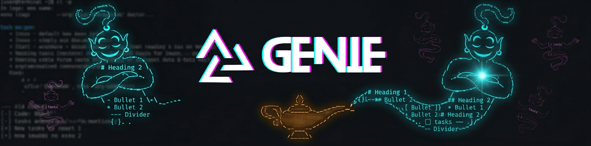

<p align="center">
  
</p>

<p align="center"><strong>Wishes in, PRs out.</strong></p>

<p align="center">
  <a href="https://github.com/automagik-dev/genie/releases"></a>
  <a href="https://github.com/automagik-dev/genie/stargazers"></a>
  <a href="LICENSE"></a>
  <a href="https://discord.gg/xcW8c7fF3R"></a>
</p>

<br />

Genie is a planning-and-execution layer for AI coding agents. You describe what you want in one sentence; Genie interviews you into a plan, dispatches agents to build it in parallel, reviews the result against acceptance criteria, and hands you something ready to merge.

The whole thing is a lightweight body: a set of skills, plain-markdown documents in git, and a single per-repo SQLite file. No daemons, no Postgres, nothing resident. A command opens the database, runs one transaction, and exits.

**Stable is declared for Linux and macOS.** Both legs run in the release gate, so a change that breaks either one does not ship. Windows is not supported; WSL2 works but is not on the tested matrix.

## Install

```bash
curl -fsSL https://raw.githubusercontent.com/automagik-dev/genie/main/install.sh | bash
```

Every release is cosign-signed (keyless OIDC) with SLSA provenance, and `genie update` verifies it **offline, with no GitHub credential**: the release's own signed delivery evidence is checked against an embedded Sigstore trust root with the publishing workflow's certificate identity pinned, and the descriptor's `artifactSha256` is bound to the downloaded tarball before anything is extracted. `gh attestation verify` is an advisory cross-check on top — a host with no `gh` still updates and says so in one line; a `gh` that ran and says the artifact does not verify still aborts.

The repository-hosted `.well-known/latest.json` and `dev.json` manifests are the authoritative channel pointers. GitHub's `/releases/latest` route and prerelease badge are deliberately not channel authority: a promotion advances only a monotonic manifest and never rewrites already-published assets or channel-significant draft/prerelease/latest metadata.

Genie ships exactly two surfaces, and nothing else:

1. **The signed binary** — installed and updated by `install.sh` and `genie update`.
2. **The skills, and the saved-workflow catalog beside them** — delivered by the [skills.sh](https://skills.sh) channel. `genie install` and `genie update` run the pinned skills CLI over the tree the signed release put on disk, deliver `.claude/workflows/*.js` into `~/.claude/workflows`, then record what landed in `~/.genie/skills-install.json`.

Any value other than `none` installs to **every** detected agent skill home, because the skills CLI already installs per agent; `none` skips the channel entirely, writes no record, and reports `skills: skipped (consent: none)`.

[UPGRADING.md](UPGRADING.md)

## Quickstart

The lifecycle is shared by every agent the skills channel reaches. Claude Code invokes a skill as a slash command; Codex and the rest invoke it by name or in plain language:

```text
1. /brainstorm or "brainstorm this"   an idea → DESIGN.md → mandatory design review
2. /wish or "deliver this"            one decided task → a merge-ready PR; bigger work → a scoped WISH.md
3. /review                            mandatory plan review; persist APPROVED or concrete gaps
4. /work                              native role subagents build each approved group
5. /review                            independent implementation review: SHIP, FIX-FIRST, or BLOCKED
```

Skills are discovered from the agent's own global skills home, so there is no owner-qualified selector and no plugin tier to disambiguate against. The starter cards shipped inside each skill stay selector-free for the same reason.

Re-run `genie board` any time for a current snapshot of task state on the kanban. The plan documents land in git as you go; the operational state lives in `.genie/genie.db`.

## What's inside

- **Skills** carry the methodology — `brainstorm → design review → wish → plan review → work → implementation review`, authored once in runtime-neutral form and delivered to every agent skill home.
- **Documents in git.** Wishes, designs, and brainstorms are plain markdown under `.genie/wishes/<slug>/` and `.genie/brainstorms/<slug>/`; you diff, review, and version them like any other code.
- **One file of state.** Tasks, boards, dependency edges, and wish-group execution state live in a single per-repo SQLite file (`.genie/genie.db`), on Bun's built-in engine.
- **Small.** 16 CLI commands, 6 runtime dependencies (`@inquirer/prompts`, `commander`, `zod`, and the `@sigstore/bundle`, `@sigstore/protobuf-specs`, `@sigstore/verify` trio that verifies a release offline). A ~2 MB single-file bundle. Bun-powered.
- **Spawn-context contract.** `genie context --wish <slug> [--group g] [--plan]` emits one line of versioned JSON — composed branch + resolved base SHA + ready tasks — that a spawn consumes. `--plan` previews the same payload without side effects; the wishless form resolves the repo's integration branch for plain spawns.
- **Saved workflows.** A catalog of scripts for the procedures worth running the same way twice — `council`, `docs-audit`, `observability-review`, `pm-ledger-verify`, `research-sweep`, `skill-audit-sweep`, `skill-intake`, `wish`, `workfly` — delivered to `~/.claude/workflows` on every install and update, alongside the skills.
- **Microagents.** `genie mikro` runs narrow, repository-local agents defined by a prompt and an answer schema, returning validated JSON whose every citation is verified against the tree. `init`, `fixtures --from-commits`, `bench` and `coach` seed, measure and refine a repository's own agents, and every agent resolves repo-first behind a trusted root.
- **A linter for the plan itself.** `genie wish lint [--dir <repo>]` checks any repository's `.genie/wishes` for structure, writes nothing, and exits 0 clean, 1 findings, or 2 when `--dir` is refused — so a malformed plan fails in CI instead of after a wasted execution wave. Its sibling `genie wish report <runId>` reads the workflow run record the runtime writes and reports tokens and time only; `--append` writes one row to the machine-local `<GENIE_HOME>/metrics/wish-runs.jsonl` ledger.
- **Zero daemons, no Postgres.** Nothing runs in the background between invocations.

## Commands

```bash
genie --help
```

| Command | What it does |
|---------|-------------|
| `genie init` | Scaffold per-repo state and retire proven Genie-owned project MCP registrations |
| `genie context` | Resolve spawn context — wish/group branch + base SHA, or the integration branch (versioned JSON; `--plan` previews) |
| `genie board` | Kanban view of task state, derived live by query |
| `genie idea` | Capture an idea into the roadmap board Idea lane (creates the board if absent) |
| `genie task` | Inspect and drive task state (SQLite, zero-daemon) |
| `genie install` | Finish a verified install and converge the skills channel under the recorded consent scope |
| `genie mikro` | Run and grow mikro microagents in any repository — `mikro call <agent> --prompt "…"` returns validated JSON whose every citation is verified; `init`, `fixtures --from-commits`, `bench` and `coach` seed, measure and refine that repository's own agents |
| `genie config` | Read the resolved global config — `config get budgets.maxEscalationsPerGroup` prints one schema key |
| `genie setup` | Configure Genie |
| `genie orca` | Retired — a one-release stub that prints a retirement notice and exits 2; the Orca integration is gone |
| `genie doctor` | Run diagnostic checks on the installation (`--fix-global-db` repairs a contaminated machine-scope database, backup-first) |
| `genie shortcuts` | Manage terminal keyboard shortcuts |
| `genie update` | Update Genie to the latest GitHub release |
| `genie wish` | Wish-document verbs for any repository — `wish lint [--dir <repo>]` lints `<repo>/.genie/wishes` for structure, writes nothing, and exits 0 clean / 1 findings / 2 refused root; `genie wish report <runId> [--append] [--summary] [--variant <name>] [--record <path>]` reads the workflow run record the runtime writes and reports tokens and time only — `--append` writes one row to the machine-local `<GENIE_HOME>/metrics/wish-runs.jsonl` ledger (not in the repository) |
| `genie uninstall` | Remove Genie, the recorded skills install, and plugin-era leftovers proven to be Genie-owned |
| `genie help` | Show help for any command |

## Skills

Skills are the product. Invoke them as `/name` in Claude Code, or by name or plain language in Codex and every other agent that reads the shared skills home:

| Skill | What it does |
|-------|-------------|
| `brainstorm` | Explore a vague idea until it's a concrete DESIGN.md |
| `wish` | Turn a design into a scoped WISH.md with execution groups |
| `work` | Dispatch native role subagents wave by wave |
| `review` | Independent design, plan, implementation, PR, or focused repository audit |
| `council` | Runs the saved `council` workflow (`.claude/workflows/council.js`): independent architecture, delivery, product, security, and dissent lenses plus a synthesis, assess-only |

Shared skill bodies use a runtime-neutral delegation contract: they name portable roles and let each runtime map them onto its own native subagents. Genie installs no custom agent profiles. Subagents share a workspace, so task claims own scope; worktree isolation, when required, is orchestrator-arranged per the dispatch contract. The engineer reports completion, an independent reviewer returns a verdict, and only the orchestrator runs `genie task done`. `/level-up` remains Claude-only because it evaluates Claude Code mastery.

The [skill catalog](skills/README.md) lists all eighteen skills by category (lifecycle, routing, delivery, investigation, authoring, verification, integration, skill-ops) with an advisory `mutates` axis, plus replacement routes for consolidated names. Quality audits now use optional `review` lenses, `report` includes root-cause investigation, and the core lifecycle skills run on genie's own board. `refine --for openai` and `refine --for claude` choose prompting guidance based on the official Astra and Fable documentation linked in the skill.

The public `npx skills add automagik-dev/genie` command serves the repository's default branch instead, so it can be
ahead of or behind any release.

Codex reads the shared `~/.agents/skills` home; the skills CLI creates no `~/.codex/skills`.

After a zero-exit install, Genie records `~/.genie/skills-install.json` — the release tag, the pinned CLI version,
the skill inventory, every agent directory the install actually wrote (a bounded scan of your home, not a fixed
table), a content digest per directory, and any collisions it backed up.

[UPGRADING.md](UPGRADING.md)

## How it works

Documents live in git; operational state lives in one SQLite file. `work` fans agents out through the active client's native subagents — each gets a task claim, with state changes serialized through `genie.db` rather than a coordinator. Review runs as a separate subagent from the one that wrote the code (reviewer ≠ engineer), so the verdict is independent evidence against the wish criteria.

All linked worktrees of a repository share one `genie.db`, resolved from the git common directory, so a task created in one worktree is immediately visible in another with no sync step.

[UPGRADING.md](UPGRADING.md)

## Roadmap

No dates — direction, not promises:

- **More emit targets.** Continue expanding native clients beyond Claude, Codex, and Hermes.
- **CDN distribution.** Serve signed releases from a CDN for faster, wider installs.

[UPGRADING.md](UPGRADING.md)

---

<p align="center">
  <a href="https://docs.automagik.dev/genie"><strong>Docs</strong></a> &middot;
  <a href="https://github.com/automagik-dev/genie/releases"><strong>Releases</strong></a> &middot;
  <a href="https://discord.gg/xcW8c7fF3R"><strong>Discord</strong></a> &middot;
  <a href="LICENSE"><strong>MIT License</strong></a>
</p>

<p align="center"><sub>You describe the problem. Genie does the rest.</sub></p>

[UPGRADING.md](UPGRADING.md)
