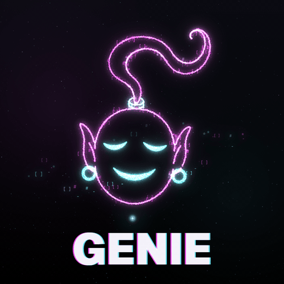
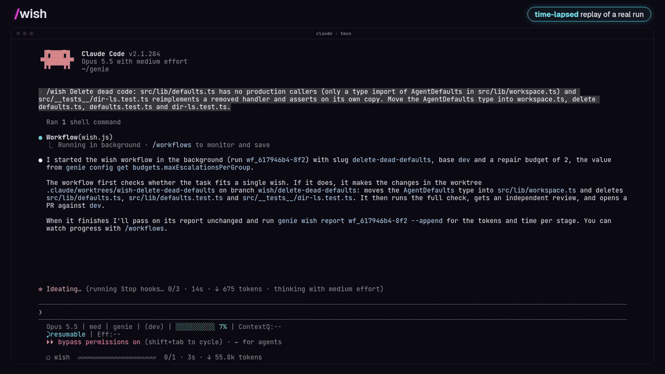
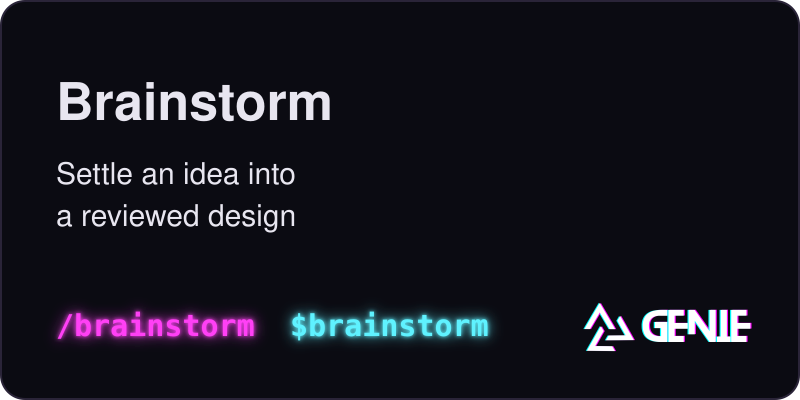
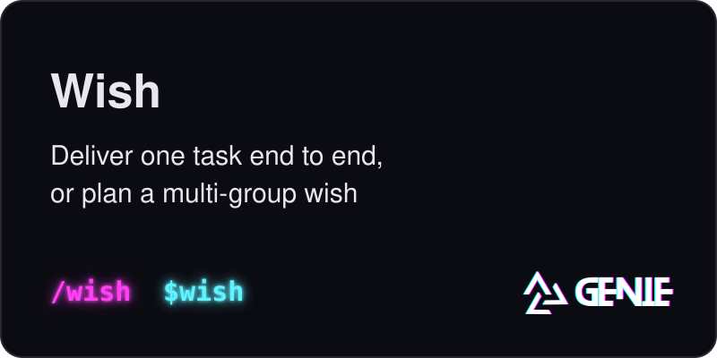
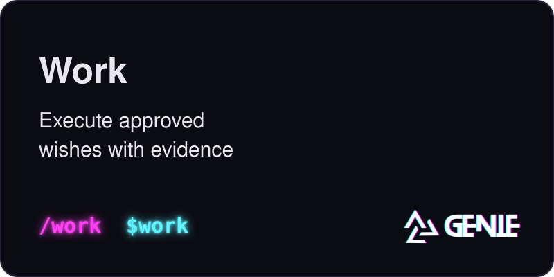
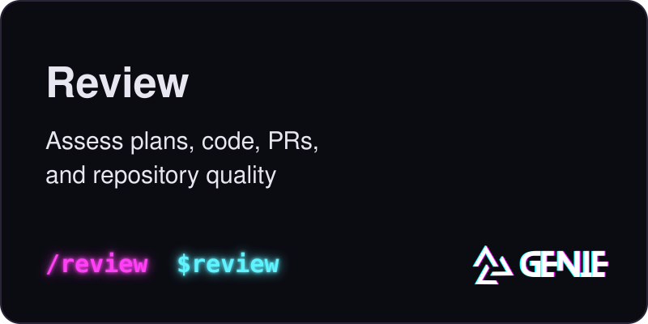
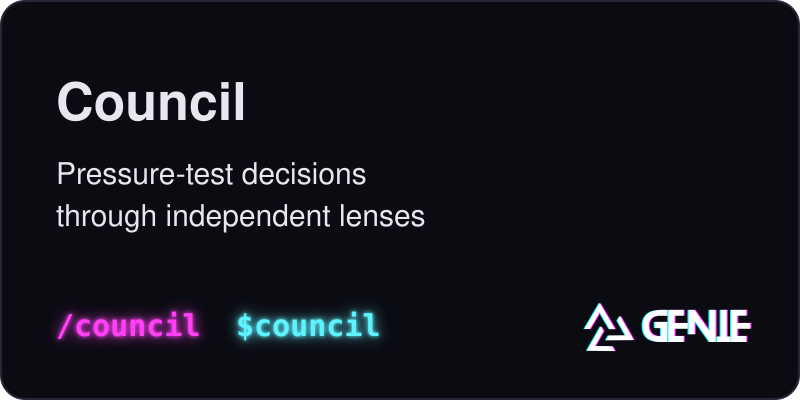
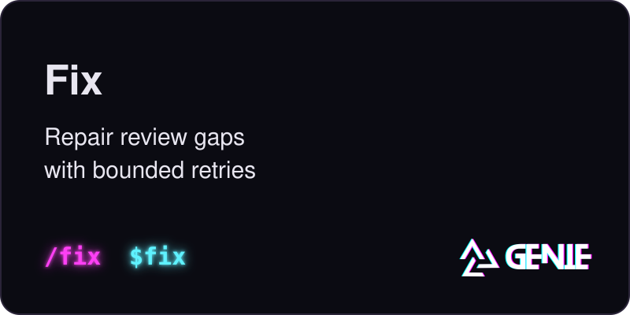

<p align="center"></p>

<p align="center"><strong>Code is a commodity. Harnesses get replaced. Context stays.</strong></p>

<p align="center">
  <a href="https://docs.automagik.dev/genie/quickstart"></a><br>
  <sub>A time-lapsed replay of a real <code>/wish</code> run, host details hidden and agent launch line removed. Its figures are one labelled sample, from its own <code>genie wish report</code>. <a href="https://docs.automagik.dev/genie/quickstart">Full video</a></sub>
</p>

Give `/wish` one decided task. It checks that the task fits, builds it in its own worktree, runs your repository's own check, has an agent that did not write the code review the exact commit, and opens a pull request. Merging stays with you.

```bash
curl -fsSL https://raw.githubusercontent.com/automagik-dev/genie/main/install.sh | bash
```

Claude Code runs it as `/wish`, Codex as `$wish`, and other agents by name. [Docs](https://docs.automagik.dev/genie) · [Skills](https://docs.automagik.dev/genie/skills) · [Discord](https://discord.gg/xcW8c7fF3R)

One `/wish` from a real run, shortened:

```text
You:    /wish Delete dead code: src/lib/defaults.ts has no production callers
        (only a type import of AgentDefaults in src/lib/workspace.ts) and
        src/__tests__/dir-ls.test.ts reimplements a removed handler and asserts
        on its own copy. Move the AgentDefaults type into workspace.ts, delete
        defaults.ts, defaults.test.ts and dir-ls.test.ts.

Genie:  I started the wish workflow in the background on branch
        wish/delete-dead-defaults. It checks that the task fits a single wish,
        makes the change in its own worktree, runs the full check, gets an
        independent review and opens a PR against dev.

Genie:  Review: SHIP. Checks: pass. The PR is open and its remote head matches the
        local one. This run merged nothing. Merging is yours.
```

## How it works

Designs and plans stay in your repository as markdown, with the reviews that approved them, so the next agent you use reads the same context. Each step is a skill. One decided task goes straight to **wish**. Anything bigger takes the whole loop, where every gate is run by an agent that did not do the work:

**brainstorm** → design review → **wish** → plan review → **work** → implementation review → PR

- **brainstorm** settles an idea into a `DESIGN.md`. A design review approves it before any plan is written.
- **wish** delivers one task end to end and returns a pull request ready for you to merge. Work bigger than one task becomes a `WISH.md` with execution groups, and a plan review approves it before anything is built.
- **work** runs the approved groups in dependency order, each with its own scoped worker, and ends at an implementation review.
- **review** runs those reviews. After **work**, it checks the result against the plan's criteria and returns SHIP, FIX-FIRST or BLOCKED. **fix** repairs the blocking gaps with bounded retries and a fresh reviewer.
- **council** sits beside the loop. It pressure-tests a decision through independent lenses and changes nothing.

Designs, plans and verdicts land in git under `.genie/brainstorms/<slug>/` and `.genie/wishes/<slug>/`. Task state lives in one SQLite file per repository, `.genie/genie.db`, and `genie board` shows it as a kanban. Genie is built with Genie: this repository's own designs and plans are in [`.genie/brainstorms`](.genie/brainstorms) and [`.genie/wishes`](.genie/wishes).

## Skills

<p align="center"> </p>
<p align="center"> </p>
<p align="center"> </p>

Genie v6.261002.2 ships 18 skills. The [skill catalog](skills/README.md) groups them by category, and the [Skills docs](https://docs.automagik.dev/genie/skills) show a card for each one.

<details>
<summary>All 18 skills</summary>

- `authoring`: Write a Genie skill that passes the shipped contract
- `brainstorm`: Settle an idea into a reviewed design
- `council`: Pressure-test decisions through independent lenses
- `deslop`: Clean up scoped prose, code or interface without losing meaning
- `docs`: Audit docs and DX against the live product; write on request
- `fix`: Repair review gaps with bounded retries
- `genie`: Route or resume work only where Genie adds value
- `genie-hacks`: Find grounded Genie workflow patterns and recipes
- `merge`: Resolve a merge or rebase by intent, then re-run the gate
- `refine`: Improve prompts for OpenAI or Claude
- `report`: Diagnose a failure to root cause; file issues on request
- `research`: Investigate against primary sources and cite every claim
- `review`: Assess plans, code, PRs, and repository quality
- `skill-audit`: Audit the skill catalogue for overlap, staleness, drift
- `verify`: Prove completion with fresh gate, diff, and check output
- `wish`: Deliver one task end to end, or plan a multi-group wish
- `work`: Execute approved wishes with evidence
- `workfly`: Build a saved workflow from a procedure
</details>

## Workflows

A saved workflow is a Claude Code script for a procedure worth running the same way twice. `genie install` and `genie update` deliver the catalog to `~/.claude/workflows`. Genie v6.261002.2 ships 12. The [Workflows docs](https://docs.automagik.dev/genie/workflows) describe each one. In Codex and other agents without saved workflows, the skills that start them (`wish`, `brainstorm`, `council`, `docs`, `research`, `skill-audit`, `workfly`) run the same stages by hand.

<details>
<summary>All 12 saved workflows</summary>

- `brainstorm`: runs one round of a brainstorm whose state lives in `DRAFT.md`, so you answer between rounds, and ends in a reviewed `DESIGN.md`
- `council`: architecture, delivery, product, security and dissent lenses, then a synthesis; assess only
- `docs-audit`: audits every documentation surface against the live product and ranks the drift; assess only
- `evidence-gate`: verifies a frozen contract of files, commands and claims against the artifact it covers; its only write is the report
- `observability-review`: reviews traced Claude Code sessions in Phoenix and proposes rule changes, each tied to cited evidence; proposal only
- `pm-ledger-verify`: adversarial lenses over uncommitted wish ledger edits
- `research-sweep`: investigates a frozen question against a frozen source list and keeps every claim cited; read only
- `skill-audit-sweep`: sweeps the shipped skills into a keep, improve, update, merge or retire table; assess only
- `skill-intake`: assesses candidate skills from outside the catalog and assigns each exactly one disposition; mutates nothing
- `test-simplify`: audits every test file in scope and proposes batches of tests to delete or consolidate; deletes nothing
- `wish`: the engine behind the `wish` skill: admission, one executor in a worktree, a gate, an independent review, bounded repair and a PR; merging stays with you
- `workfly`: discovers a procedure and builds its saved workflow, checked by a static test and refuters
</details>

## When not to use it, and what it costs

Genie adds steps around the code. They pay off when a change deserves review, and they cost you time when it does not.

- **Small, obvious edits.** The run above asked 0 questions and, by its own `genie wish report`, took 19.9 min and 387,079 tokens to delete dead code. That is one sample. An edit you can make and check by hand is faster without Genie.
- **Big plans.** Plan size predicts delivery. In an observational sample of 50 wishes, the share merged within 8h fell from 100% (n=9) for the smallest plans to 95% (n=19), 67% (n=12) and 30% (n=10) for the largest. Split big work before it starts.
- **Diffs you will not read.** Agents miss things, reviewers included. The reviewer passed a wrong gate command in [#3045](https://github.com/automagik-dev/genie/pull/3045), and [#2935](https://github.com/automagik-dev/genie/pull/2935) met 68 of 86 blind criteria with 3 HIGH gaps. Read the diff and the verdict before you merge.
- **Weak checks.** The gate runs your repository's checks, so a wish proves only what those checks prove.
- **Untrusted repositories, or no integration branch.** `/wish` runs the repository's own install and check commands, so point it only at repositories you trust. It opens its pull request against `dev` by default and refuses `main` or `master` as the base.

## How it compares

Superpowers, Spec Kit and GSD work the same ground. Each of their rows comes from that project's own README.

| | What it says it is | Its loop | How it installs |
|---|---|---|---|
| [Superpowers](https://github.com/obra/superpowers) | "a complete software development methodology for your coding agents, built on top of a set of composable skills" | brainstorming, writing plans, then executing them with subagents or inline, with code review and test-driven development | installed per harness, "separately for each one" |
| [Spec Kit](https://github.com/github/spec-kit) | "an open source toolkit that gives AI coding agents structured processes, reusable templates, and documented outcomes" | a constitution once per project, then specify, plan, tasks, implement and converge for each feature | `uv tool install specify-cli` |
| [GSD](https://github.com/open-gsd/gsd-core) | "a context-engineering and spec-driven development framework" that runs heavy work "in fresh-context subagents" | discuss, plan, execute, verify and ship, one phase at a time | `npx @opengsd/gsd-core@latest` |
| Genie | skills and saved workflows that keep plans in git, plus a CLI that keeps task state in one SQLite file | brainstorm, wish, work and review, with council beside it and a separate reviewer at each gate | one signed binary that installs the skills into every agent it detects |

## Install

The one-paste install at the top fetches the signed binary for Linux or Apple Silicon macOS and finishes with `genie install`. Stable is declared for Linux and macOS: both run in the release gate, so a change that breaks either one does not ship. Windows is not supported; WSL2 works but is not on the tested matrix. Coming from an earlier version? [UPGRADING.md](UPGRADING.md) covers what changed, what left, and how to clean up.

<details>
<summary>What the install delivers, consent scopes and release verification</summary>

Genie ships exactly two surfaces:
- **The signed binary**, installed and updated by `install.sh` and `genie update`.
- **The skills and the saved workflows**, delivered through the [skills.sh](https://skills.sh) channel. `genie install` and `genie update` run the pinned skills CLI over the tree the signed release put on disk, copy the workflows into `~/.claude/workflows`, and record what landed in `~/.genie/skills-install.json`.

The installer hands its arguments to `genie install`. `--integrations auto|codex|claude|all|none` (or `--skip-integrations`) is the consent scope for the skills channel: any value other than `none` installs to every detected agent skill home, because the skills CLI already installs per agent; `none` skips the channel, writes no record, and reports `skills: skipped (consent: none)`. To install the binary and skip the skills channel:

```bash
curl -fsSL https://raw.githubusercontent.com/automagik-dev/genie/main/install.sh | bash -s -- --integrations none
```

Each detected agent gets the skills in its own skills home: `~/.claude/skills` for Claude Code, and the shared `~/.agents/skills` for Codex and the other agents that read it. `genie install` and `genie update` install the skills from the tree the signed release delivered, never from a GitHub ref. The public `npx skills add automagik-dev/genie` command serves the repository's default branch instead, so it can be ahead of or behind any release.

Every release is cosign-signed with SLSA provenance, and `genie update` verifies it offline, with no GitHub credential. The repository-hosted `.well-known/latest.json` and `dev.json` manifests are the authoritative channel pointers. GitHub's `/releases/latest` route and prerelease badge are deliberately not channel authority: a promotion advances only a monotonic manifest and never rewrites already-published assets or channel-significant draft/prerelease/latest metadata. [Security and releases](https://docs.automagik.dev/genie/security) has the details.
</details>

## Commands

Genie v6.261002.2 has 16 CLI commands. Nothing runs in the background: every command does its work and exits. The [CLI reference](https://docs.automagik.dev/genie/cli-reference) has the full `--help` output.

<details>
<summary>All 16 commands</summary>

| Command | What it does |
|---------|-------------|
| `genie board` | Kanban view of task state, derived live by query |
| `genie config` | Read the resolved global config, for example `config get budgets.maxEscalationsPerGroup` |
| `genie context` | Resolve spawn context as versioned JSON: the wish or group branch and base SHA, or the integration branch |
| `genie doctor` | Check the installation; `--fix-global-db` repairs a contaminated machine-scope database, backup first |
| `genie help` | Show help for any command |
| `genie idea` | Capture an idea into the roadmap board's Idea lane |
| `genie init` | Set up per-repository state and remove Genie's own historical MCP entries, backup first |
| `genie install` | Finish a verified install and deliver the skills under the consent scope you chose |
| `genie mikro` | Run and grow mikro microagents in any repository; `mikro call <agent>` returns validated JSON with every citation checked |
| `genie orca` | Retired: a stub for one more release that prints a notice and writes nothing |
| `genie setup` | Configure Genie |
| `genie shortcuts` | Manage tmux keyboard shortcuts |
| `genie task` | Inspect and drive task state |
| `genie uninstall` | Remove the Genie CLI, its `~/.genie` home (backups kept), its client plugin registrations and the skills and workflows it recorded |
| `genie update` | Update to the latest signed release, verified offline |
| `genie wish` | `wish lint` checks any repository's wishes for structure; `wish report <runId>` prints a run's tokens and time per stage |
</details>

## Links

[Docs](https://docs.automagik.dev/genie): [Skills](https://docs.automagik.dev/genie/skills), [Workflows](https://docs.automagik.dev/genie/workflows), [CLI reference](https://docs.automagik.dev/genie/cli-reference), [Security and releases](https://docs.automagik.dev/genie/security) · [UPGRADING.md](UPGRADING.md) · [Releases](https://github.com/automagik-dev/genie/releases) · [automagik-dev](https://github.com/automagik-dev), the org behind Genie · [Discord](https://discord.gg/xcW8c7fF3R) · [MIT License](LICENSE)
