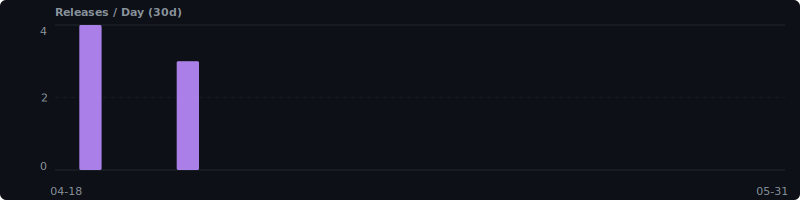
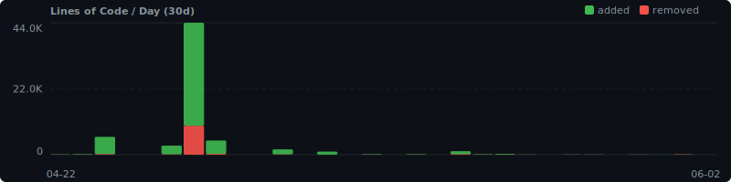

# Velocity Dashboard

> Last updated: 2026-04-22 12:33 UTC | Data range: 2026-03-13 to 2026-04-22

## At a Glance

| Metric | 7 days | 30 days | All time |
|--------|-------:|--------:|---------:|
| Commits | 114 | 1.3K | 498 |
| Releases | 6 | 252 | 0 |
| LoC (net) | +22.6K | +162.0K | — |
| Contributors | 6 | 11 | 11 |

---

## Commits per Day

## Releases per Day

## Lines of Code per Day

---

## Contributor Leaderboard (30d)

| Rank | Contributor | Commits (approx) |
|-----:|-------------|------------------:|
| 1 | Genie | 289 |
| 2 | Felipe Rosa | 282 |
| 3 | github-actions[bot] | 250 |
| 4 | Claude | 182 |
| 5 | Test User | 98 |
| 6 | Luís Sousa | 60 |
| 7 | Genie (env-specialist) | 16 |
| 8 | Cezar Vasconcelos | 15 |
| 9 | namastex888 | 12 |
| 10 | Zakir Jiwani | 6 |
| 11 | felipe rosa | 4 |

*11 contributors since 2026-04-09*
